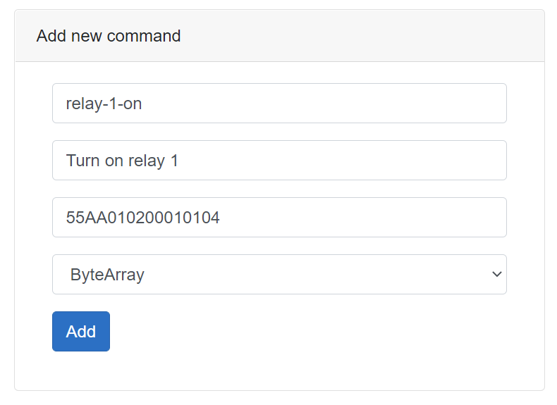

Welcome to ReBlaze
==================

Simple way to control your Ethernet relays

### What is this?

ReBlaze is a word made from Relay and Blazor. Blazor is a name of a program used to write this site.

There are many different Ethernet devices on Amazon. Those are useful. You can control power outlets, lights and other equipment with computers.While this is useful, there is a drawback. Most of those relays and devices come with incompatible interfaces and control modules.You would need to write a separate program for every device you purchased out there.

ReBlaze solves the above problems. You can purchase any device that connects to the network and instruct ReBlazeto talk to this device. You can execute commands on your relays right in this app,or you can get smart links that you can plug into any other app to control your devices.

### Basic concept


ReBlaze has a database in its core. You need to explain to it what devices you have on the network,how to name those and what commands to send.Once this is done you can send the device name and command name to the ReBlaze, and it willsend the actual command to a device.

### How to build this

```
dotnet ef database update
dotnet run
```

Once you are done changing the source code, use `publish.cmd` to publish the system on a Windows platform. From there you can either deploy it on your server, or if you want to give this to someone as a standalone toy on Windows use run.cmd to bootstrap the system. 

### Programming a device model

Once you purchase a device you need to open Models tab and create a new model. Type the name of the model, and it's description.Once it's done you should open settings of the model and set up the commands.

Most of the devices come with some sort of a manual. It's either hard-copy or a PDF. In the manual you can find actualcommands you would need to send over the network to activate one or the other function.

Commands could be one of 4 types:

*   ASCII String
*   UTF String
*   Byte Sequence
*   Binary Sequence

Study your device documentation to figure out what are you trying to send to the device.

#### Example - sending a command as a Byte Sequence

Below is an excerpt from the manual of RLY-8 DF Robots relay.


You can clearly see what sequence of bytes you need to send to the device to activate one or another function.Let's implement this command in our system.

Go to the [Models](models) and create a new device model at the bottom of a page. Type a model name and it's description.


After this is done, go to the settings page of this new device. The only option you will see would be "Add command".



Type a name for this command (`relay-1-on`), write a description and type the exact sequence ofbytes you can see in the manual in the payload field. Select the command type to be ByteArray.

Once this is done, go to the [Devices](devices/) page. Create a new device with the name `shr`,appropriate address and port that you can find in the manual and select RLY 8 as a model.

When the above is done, find this new device in a list, and press "Show commands" link. You will see allavailable commands for RLY 8 device. Click on a thunderbolt icon next to "Turn On Relay 1"command and your relay will execute the command.

#### Other types of the commands - Binary and Strings

It gets easier. It's very improbable that you will find a device that has to work with binary codes. But if anything, you can just send a string of zeroes and ones that will be converted to a binary numbers

Most of the devices will use strings of some sort to set state. It's the easiest thing to program. Let's look in the manual again:


Here one can see a string of text you can send to the device to turn on first 6 relays. Add a new command, select format of UTF String and type just exactly that in the payload field:`{"relay1":"on","relay2":"on","relay3":"on","relay4":"on","relay5":"on","relay6":"on","relay7":"off","relay8":"off"}`

Now you can send this command to your device.

### Important note - names of devices and commands

It's crucial to name devices and commands as simple as you can. Those names will be a part of a control URL, thus if you will call your device `Best Relay Ever`and your command `Command to turn on all the relays on the base` your final URL might be very cumbersome, like`http://control/commands/Best%20Relay%20Ever/Command%20to%20turn%20on%20all%20the%20relays%20on%20the%20base`

A smarter idea would be to call your device something like `lobby-1` , and the command should be called `all-on`. In this case, your final URL toexecute this command would be `http://control/commands/lobby-1/all-on`, which is much easier to manage.

### Using command URLs

To the left of the thunderbolt icon you will see a command URL. It's a special web address. Should you go to that address, the applicable command will be executed.In your case, it will look something like [http://control/commands/shr/relay-1-on](#). (Not an actual link)

You can copy this link into your browser and go there. The command would be executed at once. It's useful to configure different systems.